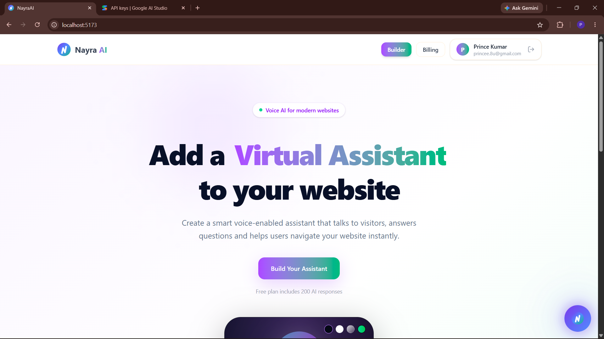
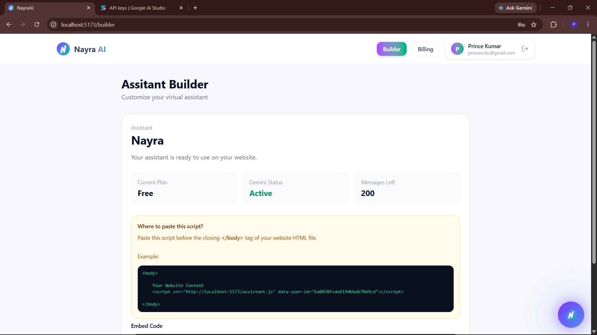
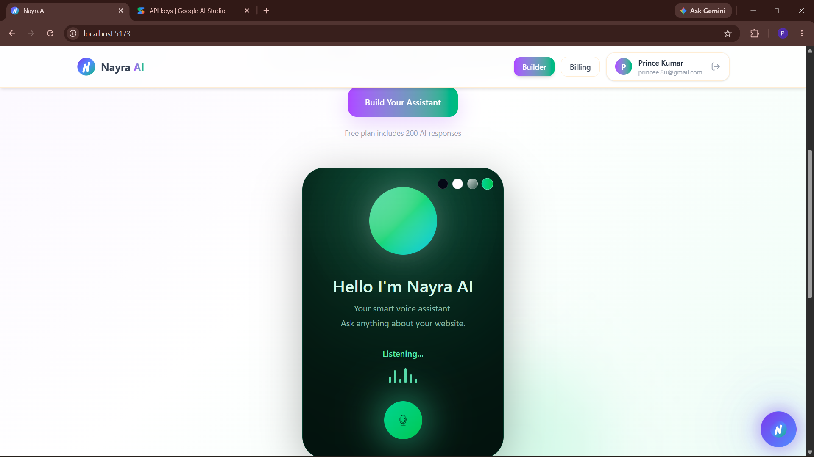

<div align="center">

# 🎙️ NayraAI

### Voice AI Assistant SaaS Platform

Build and embed a customizable AI voice assistant on any website with a single script tag.

[](https://nayraai.onrender.com)
[](https://github.com/priyanshu19f/NayraAI-Voice-Assistant-SaaS)

<br />


</div>

---

## 📖 About

**NayraAI** is a full-stack SaaS platform that allows businesses to add a customizable **AI-powered voice assistant** to their websites using a single script tag.

The platform combines **Google Gemini** for conversational AI with the browser's native **Web Speech API** for speech recognition and text-to-speech, allowing website visitors to interact with an AI assistant using their voice.

NayraAI also provides an **Assistant Builder**, authentication, subscription management, custom branding, AI-powered navigation, encrypted API key storage, and automated emails.

This project was built end-to-end as a **solo full-stack project**, covering frontend development, backend APIs, authentication, database design, security, payments, media management, and deployment.

---

## 🚀 Live Demo

🌐 **Try NayraAI:**
https://nayraai.onrender.com

💻 **Source Code:**
https://github.com/priyanshu19f/NayraAI-Voice-Assistant-SaaS

---

## ✨ Features

### 🤖 AI & Voice

* **AI-powered conversations** using Google Gemini
* **Real-time voice interaction** directly in the browser
* Speech-to-text using the native **Web Speech API**
* Text-to-speech using the browser's speech synthesis capabilities
* Configurable assistant persona and behavior
* Context-aware responses based on the assistant configuration

### 🔌 Website Integration

* Integrate the assistant using a **single `<script>` tag**
* No complex SDK setup required
* Designed to work with existing websites
* Embeddable voice assistant interface

### 🧩 Assistant Builder

Businesses can configure their assistant through a dedicated builder:

* Assistant personality
* AI configuration
* Knowledge/context
* Subscription plan
* Embed configuration
* Branding options

### 🔐 Authentication & Security

* Google authentication using **Firebase Authentication**
* JWT-based session handling
* Secure API communication
* API keys encrypted before being stored
* AES-256-GCM encryption for sensitive API credentials
* Subscription-based feature authorization

### 💳 Payments

* Razorpay integration for subscription payments
* Pro-tier feature access
* Payment verification
* Automated payment receipt emails

### 🎨 Custom Branding

Pro users can customize the assistant experience with:

* Custom logo
* Branded assistant interface
* Cloudinary-powered image uploads

### 🧭 AI-Powered Navigation

Pro users can enable AI-driven navigation, allowing the assistant to help visitors navigate different pages of the website based on conversational requests.

### 📧 Automated Emails

NayraAI can automatically send emails for events such as:

* Welcome emails
* Payment receipts
* Other transactional communication

---

## 🛠️ Tech Stack

### Frontend

* React
* Redux Toolkit
* Tailwind CSS

### Backend

* Node.js
* Express.js
* MongoDB
* Mongoose

### Authentication & Security

* Firebase Authentication
* Google OAuth
* JWT
* AES-256-GCM Encryption

### AI & Voice

* Google Gemini API
* Web Speech API
* Speech Recognition
* Speech Synthesis

### Payments & Media

* Razorpay
* Cloudinary

### Email

* Nodemailer

### Deployment

* Render

---

## ⚙️ How It Works

The overall workflow is designed to keep the integration simple for website owners.

```text
          ┌─────────────────────┐
          │   Business Owner    │
          └──────────┬──────────┘
                     │
                     ▼
          ┌─────────────────────┐
          │  Assistant Builder  │
          │ Persona • Knowledge │
          │ Branding • Settings│
          └──────────┬──────────┘
                     │
                     ▼
          ┌─────────────────────┐
          │   Embed Script Tag  │
          └──────────┬──────────┘
                     │
                     ▼
          ┌─────────────────────┐
          │ Website Visitor     │
          │   🎤 Voice Input    │
          └──────────┬──────────┘
                     │
                     ▼
          ┌─────────────────────┐
          │ Web Speech API      │
          │ Speech → Text       │
          └──────────┬──────────┘
                     │
                     ▼
          ┌─────────────────────┐
          │   NayraAI Backend   │
          └──────────┬──────────┘
                     │
                     ▼
          ┌─────────────────────┐
          │    Google Gemini    │
          │   AI Response       │
          └──────────┬──────────┘
                     │
                     ▼
          ┌─────────────────────┐
          │ Web Speech API      │
          │ Text → Speech       │
          └──────────┬──────────┘
                     │
                     ▼
          ┌─────────────────────┐
          │   🔊 Voice Reply    │
          └─────────────────────┘
```

### Integration Flow

1. A business creates an account on NayraAI.
2. The business configures its AI assistant using the Assistant Builder.
3. NayraAI generates an embed script for the assistant.
4. The business adds the script to its website.
5. Visitors can interact with the assistant using their voice.
6. Speech is converted into text in the browser.
7. The request is processed using the configured AI model.
8. The generated response is converted back into speech.
9. Pro users can additionally access features such as AI-powered navigation and custom branding.

---

## 📸 Screenshots

### 🏠 Landing Page

The NayraAI landing page introduces the platform and its capabilities.



---

### 🧩 Assistant Builder

Configure the assistant's behavior, settings, and integration options from the Assistant Builder.



---

### 🎙️ Assistant in Action

The voice assistant embedded into a website and interacting with the visitor.



---

## 🔒 Security

Security was an important part of the architecture rather than an afterthought.

### API Key Encryption

Sensitive API credentials are **not stored as plaintext**.

NayraAI uses **AES-256-GCM encryption** to protect API keys at rest. The encrypted credentials are decrypted only when they are required for AI inference.

### Authentication

Authentication is handled through:

* Firebase Authentication
* Google OAuth
* JWT-based session management

### Authorization

Subscription-based authorization is used to control access to premium features such as:

* AI-powered navigation
* Custom branding
* Pro assistant capabilities

---

## 📁 Project Structure

```text
NayraAI/
│
├── Client/                         # React frontend
│   ├── public/                     # Public assets
│   └── src/                        # React application source
│
├── Server/                         # Node.js + Express backend
│   ├── Config/                     # Database and service configuration
│   ├── Controllers/                # Request/business logic
│   ├── Middlewares/                # Authentication and middleware
│   ├── Models/                     # MongoDB/Mongoose models
│   └── Routes/                     # API route definitions
│
└── screenshots/                    # README screenshots
    ├── landing.png
    ├── assistant_builder.png
    └── assistant_demo.png
```

---

## 🧠 What I Learned

Building NayraAI helped me work across the complete lifecycle of a modern full-stack application.

Some of the major areas I worked with include:

* Designing a full-stack SaaS architecture
* Building REST APIs with Node.js and Express
* Managing application state with Redux Toolkit
* Integrating Google Gemini into a production-style application
* Working with browser-based speech technologies
* Implementing Google OAuth with Firebase
* Managing JWT-based authentication
* Encrypting sensitive credentials using AES-256-GCM
* Integrating Razorpay payments
* Implementing subscription-based feature access
* Uploading and managing media with Cloudinary
* Sending transactional emails with Nodemailer
* Deploying and maintaining a full-stack application

---

## 🎯 Project Highlights

| Area           | Implementation                       |
| -------------- | ------------------------------------ |
| AI             | Google Gemini API                    |
| Voice          | Browser Web Speech API               |
| Frontend       | React + Redux Toolkit + Tailwind CSS |
| Backend        | Node.js + Express.js                 |
| Database       | MongoDB + Mongoose                   |
| Authentication | Firebase + Google OAuth + JWT        |
| Security       | AES-256-GCM encryption               |
| Payments       | Razorpay                             |
| Media          | Cloudinary                           |
| Email          | Nodemailer                           |
| Deployment     | Render                               |
| Integration    | Single-script website embed          |

---

## 👨‍💻 Author

### Priyanshu Gupta

**Full Stack Developer (MERN)**

I enjoy building real-world applications that combine modern web technologies with AI to solve practical problems.

[](https://www.linkedin.com/in/priyanshuguptaofficial/)

[](https://github.com/priyanshu19f)

---

## ⭐ Support

If you found **NayraAI** interesting or useful, consider giving the repository a ⭐ on GitHub.

Your support is appreciated!

<div align="center">

### Built with ❤️ by Priyanshu Gupta

</div>
